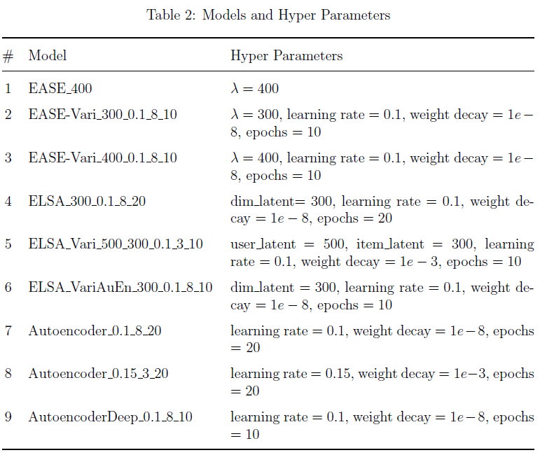
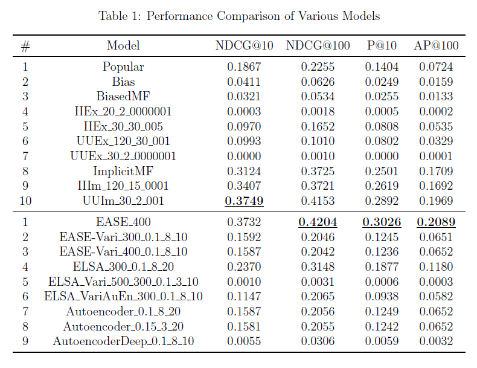

# recommender-systems-algo-autoencoder-varients

## Introduction

In this project, I reproduced the EASE model and the ELSA model, and
implemented several variants of them, so as to evaluate and compare the performances
of autoencoder-like models on movie recommendations. Through
the experiments on the customized MovieLens-11kU dataset, I found that
the EASE model had a better performance than the ELSA model, while
the ELSA model is more computationally scalable. Both of the two models
made better recommendations than classic autoencoder models, and shallow
autoencoder models were superior to deep ones for this task. Additionally,
adding shallow hidden layers to the ELSA model adversely affected the performance
of the ELSA model.

References:  
1. An implementation of the EASE model: https://github.com/franckjay/TorchEASE  
2. The official implementation of the ELSA model: https://github.com/recombee/ELSA/blob/main/README.md

## About the dataset
The dataset I used for experiments is a customized MovieLens-11kU dataset, which
was adapted from HW3 (which is a preprocessed dataset derived from the movielens 32M collection, https://files.grouplens.org/datasets/movielens/ml-32m-README.html). It composed of two parts of users. The first part is from
1,011 users of the test set. The second part is achieved by randomly choosing 10k users
from the HW3 explicit training set (extracting the users from the test set beforehand).
Combining the two parts together, I finally generated the explicit training set of 11,011
users and 18,221 movies. For the implicit training set, it is composed of 10,925 users
and 18,221 movies, as some of the users chosen in the explicit training set had no ratings
over or equal to 4.0 and such that do not appear in the original implicit training set.
All the models reproduced and implemented in this project used the MovieLens-
11kU implicit dataset for training. As for the baseline models, part of them used the
MovieLens-11kU explicit dataset for training, and the left used the MovieLens-11kU
implicit dataset for training, depending on the algorithms involved.

## Model Settings

The settings for the models involved in this project are as follows:

## Results

The performances of the models on the customized MovieLens-11kU dataset are as follows:

## Conculsion

The EASE model does have a good performance as claimed. And it does not require
much fine tuning as the model only has one hyper parameter and the weight parameter
could be calculated directly from the input user-item matrix without many epochs
of training. However, it is unscalable when faced with a large recommender system.
The ELSA model could relieve the problem be factorizing the weight matrix to a lowrank
plus sparse structure. However, the results from my experiments showed that the
ELSA model had a worse performance than the EASE model (under the circumstances
of without enough fine tuning). The variants I implemented did not achieve better
performances than the original EASE model and the original ELSA model, which means
including an autuencoder structure directly into the two models has adverse effects
on them. Besides, by observing the performances of the vanilla autoencoder models
I implemented, shallow autoencoder models tend to have better performances then
deeper ones. Delicate design and enough fine tuning should be leveraged to improve
the performances of autoencoder-based models.